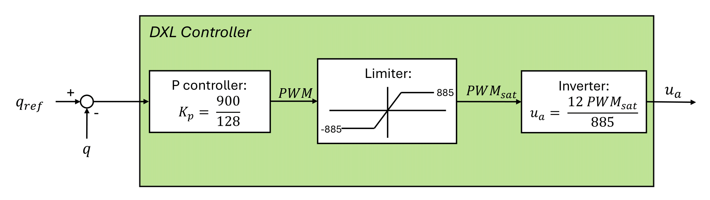

# 🤖 Pheidippides

Philippideis is a project focused on **abstraction-based control** for a **5-link planar robot**, implemented using [Dionysos.jl](https://github.com/julienCalbert/Dionysos.jl).

This repository includes multiple simulation environments based on both **JuliaRobotics** and **Robotran**. It features a position control only environments to reproduce gaits with position trajectories. It also explores abstraction-based control synthesis using **Dionysos.jl**, developed by Julien Calbert.

## 📌 Requirements

- Linux
- Git
- Julia (recommended version: 1.10.2)
- Robotran (for C/Python-based simulations)

## 📥 Installation

First create a folder in your home directory: <br>
```bash
mkdir .robotran
cd .robotran
```
Then in this directory, download [Robotran](https://www.robotran.be/download/), the MBSysC and the MBSysPad, as well as the python package MBSysPy (follow the instruction provided in the [Installation Instructions](https://robotran-doc.git-page.immc.ucl.ac.be/Installation-Instruction/Linux/#))
).

In the same repository, clone the git:

```bash
git pull
```


## 📁 Folder Structure

- `Dionysos.jl/`: Library for abstraction-based controller synthesis, developed by **Julien Calbert**.
- `JuliaRobotics/`: Simulates the robot using motor position control, solved with **JuliaRobotics**.
- `Robotran_c/` and `Robotran_py/`: Similar simulations to `JuliaRobotics/` using **Robotran** instead.
- `Robotran_J2C/`: A modified version of `Robotran_c` adapted for integration with **Dionysos.jl**.


## 💡 More Specifically

### 1. Position Control Environments

This chapter covers basic position control simulations for the 5-link planar robot. This position controller is included in the Dynamixels motors by the manufacturer:<br>
 <br>
The controller outputs a tension, which is converted to torque using the following DC motor model (at the motor level): <br>
$$\tau = k'_t u_a - (\tau_c + K'_v \dot{q})$$ 

The implemented formula is slightly different as the torques need to be at the joint levels, introducing the gear ratios in the formula.

#### 1.1 JuliaRobotics
The folder `JuliaRobotics/` contains the simulation environment of Pheidippideis using JuliaRobotics, and is divided into four folders:
- `deps/`: contains the simulation results.
- `deps/`: contains the URDF.
- `Simulator/`: contains the code. `RobotSimulator.jl/` contains all the specific functions (ground contact, controllers, ...), while `simulation_controller.jl/` runs the code.
- `WalkingPatterns/`: contains the position trajectories to follow. <br>

The codes allows to either use the position controller (data_from_WP = true) or to directly apply voltages (data_from_WP = false). To run the code :
```bash
julia
;
cd JuliaRobotics/
(suppr key to come back)
]
activate .
update
instantiate
(suppr key to come back)
include("Simulator/simulation_controller.jl")
exit()
```
As explained in our master thesis, feeding the voltages measured on the physical robot in open-loop does not work in the current state, as the simulation is not able to reproduce the ZMP trajectory.

#### 1.2 Robotran
The folders `Robotran_c/` and `Robotran_py/` follow a similar implementation to `JuliaRobotics/`, but uses MBS files instead of URDF. The python version is used for feature development dur to is ease for debugging, while the c implementation is used for its computation speed capabilities. Both implementations follow the same structure. The main folders are:
- `dataR/`: contains the mbs file of the robot. Note that if a modification is applied to the mbs, the symbolic files need to be updated (via the MBSysPad).
- `resultR/`: contains the results of the simulations.
- `userfctR/`: contains the code for the simulation. The used_DrivenJoints, user_ExtForces and usedJointForces are respectively used to drive joints (for isntance to zero for the hip), to apply external forces (ground contact) and to apply torques or forces at the joint level (motor torques).
- `WalkingPatterns/`: contains the position trajectories to follow.
- `workR/`: runs the code.

TODO


### 2. Abstraction-Based Control Environments
TODO

#### 2.1 JuliaRobotics + Dionysos.jl (`Dionysos.jl`)
TODO

#### 2.2 Robotran + Dionysos.jl (`philippides_J2C` and `Dionysos.jl`)
TODO


## 👤 Authors

Developed by **[Cédric Amerijckx, Maxime Morabito, Antonin Perilleux]**

Abstraction-based control library `Dionysos.jl` developed by **Julien Calbert**.
