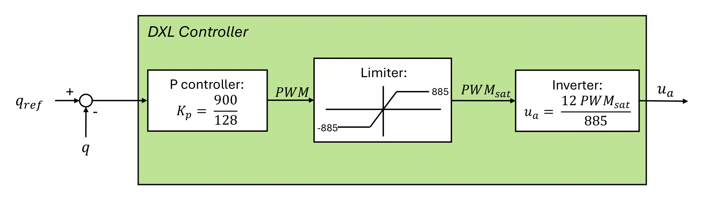

# Philippideis

Philippideis is a project focused on **abstraction-based control** for a **5-link planar robot**, implemented using [Dionysos.jl](https://github.com/julienCalbert/Dionysos.jl).

This repository includes multiple simulation environments based on both **JuliaRobotics** and **Robotran**. It features a position control only environments to reproduce gaits with position trajectories. It also explores abstraction-based control synthesis using **Dionysos.jl**, developed by Julien Calbert.

---

## 🚀 Installation

Clone the repository and update submodules:

```bash
git pull
git submodule update --recursive
```

---

## 📁 Folder Structure

- `DigitalTwin/`: Simulates the robot using motor position control, solved with **JuliaRobotics**.
- `philippides_py/` and `philippides_c/`: Similar simulations using **Robotran** instead.
- `philippides_J2C/`: A modified version of `philippides_c` adapted for integration with **Dionysos.jl**.
- `Dionysos.jl/`: Library for abstraction-based controller synthesis, developed by **Julien Calbert**.

---

## 🧭 More Specifically

### 1. Position Control Environments

This chapter covers basic position control simulations for the 5-link planar robot. This position controller is included in the Dynamixels motors by the manufacturer:<br>
 <br>
The controller outputs a tension, which is converted to torque using the following DC motor model (at the motor level): <br>
$$\tau = k'_t u_a - (\tau_c + K'_v \dot{q})$$
The implemented formula is slightly different as the torques need to be at the joint levels, introducing the gear ratios in the formula.

#### 1.1 JuliaRobotics (`DigitalTwin`)


#### 1.2 Robotran (`philippides_c` and `philippides_py`)

- Implements similar position control using the Robotran physics engine.
- `philippides_c`: C-based simulation.
- `philippides_py`: Python-wrapped version.

---

### 2. Abstraction-Based Control Environments

This chapter covers advanced control using state-space abstraction and controller synthesis.

#### 2.1 JuliaRobotics + Dionysos.jl

- Leverages `Dionysos.jl` for abstraction-based synthesis.
- Potential integration with JuliaRobotics for simulation (to be detailed if implemented).

#### 2.2 Robotran + Dionysos.jl (`philippides_J2C`)

- Combines Robotran dynamics with `Dionysos.jl` for controller synthesis.
- `philippides_J2C` acts as the bridge between the dynamic model and the abstract controller.

---

## 📌 Requirements

- Julia (recommended version: 1.x)
- Julia packages: `Dionysos.jl`, `JuliaRobotics` stack
- Robotran (for C/Python-based simulations)
- Git (for cloning and submodules)

---

## 📜 License

*Specify your license here (e.g., MIT, GPL, or "proprietary")*

---

## 👤 Author

Developed by **[Your Name or GitHub Handle]**

Abstraction-based control library `Dionysos.jl` developed by **Julien Calbert**.
